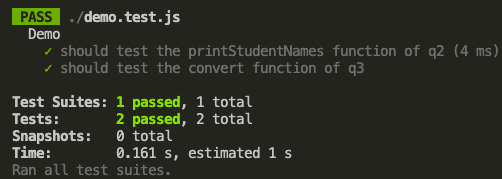

## Assignment

### Brief

Instructions are written as comment in the respective `.js` files.

- [Control Flow](./assignment/q1-control-flow.js)
- [Array & Loop](./assignment/q2-arrays-loop.js)
- [Objects](./assignment/q3-objects.js)

### Demo Unit Test

Instructor should demo the unit test at the end of the assignment.

Shell Commands:
```sh
cd assignment
npm i
npm run test
```

Output:




### Submission 

- Submit the URL of the GitHub Repository that contains your work to NTU black board.
- Should you reference the work of your classmate(s) or online resources, give them credit by adding either the name of your classmate or URL. 


### References

_Example of Referencing Classmate_

Referenced the code block below from Terence.
```js
    function printMe(){
        console.log("I am a reference example");
    }
```

_Example of Referencing Online Resources_

- https://developer.mozilla.org/en-US/
- https://www.w3schools.com/html/
- https://stackoverflow.com/questions/14494747/how-to-add-images-to-readme-md-on-github

