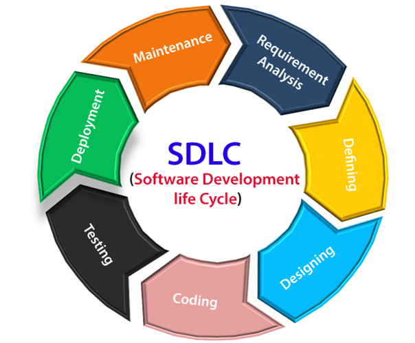
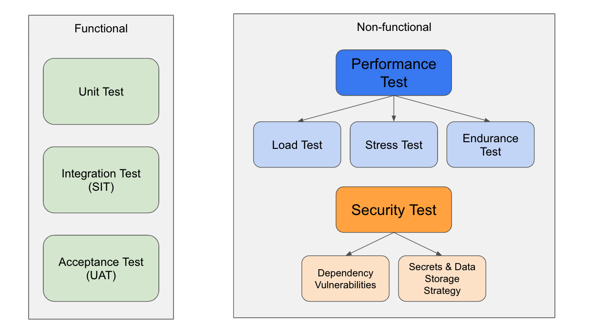

## Brief

### Lesson Overview

We will be spending the first hour to learn about software testings, and next 2 hours on quick JavaScript lesson and assignment. 

> Note for instructors
> - Run all `.js` files with `node` in the Terminal.
> - While running JS code, use debugging terminal to visually guide learners how codes are executed.

---

## Part 1 - Software Development Life Cycle



Source: https://www.javatpoint.com/software-engineering-software-development-life-cycle

1. *Requirement* Analysis - Gathering the business and technical requirements.
1. *Defining* - Defining the functional and non-functional requirements.
1. *Designing* - Translating the functional requirements into workable tasks.
1. *Coding* - Writing code a.k.a. development phase.
1. *Testing* - Ensuring the outcome of development aligns with the defined requirements.
1. *Deployment* - Going live into production.
1. *Maintenance* - Monitoring systems health and fix errors when arises.

---

## Part 2 - Software Testing Methods



### Functional Testings

1. *Unit Test* - An isolation testing targeting at the smallest piece of logic in the software.
2. *Integration Test* - Testing multiple software modules together as a group.
3. *Acceptance Test* - Testing the functionality of the software by end users before launch.

### Non-functional Testings

1. *Performance Test* - A non functional test to determine the stability, speed, responsiveness and resilience of the system.
    1. Load Test - Simulate an increasing amount of traffics/requests sent to the system.
    1. Stress Test - Determine the peak load and/or how much requests the system can receive.
    1. Endurance Test - Determine the behaviour of the system at the peak load over time.
1. *Security Test* -
    1. Dependency Vulnerabilities - Scanning for vulnerabilities introduced by dependencies.
    1. Secrets & Data Storage Strategy - Determine how secure are secrets and sensitive data being stored.
---

## Part 3 - Group Discussion

Different industries apply the stages of the Software Development Life Cycle (SDLC) in various ways, depending on their specific needs and requirements. Here is an example of how an industry approaches the SDLC stages:

### Finance and Banking
 - *Planning*: Rigorous planning is crucial due to strict regulatory compliance and security requirements. Detailed documentation and approvals are necessary.
- *Requirements Gathering*: Close collaboration with business stakeholders and legal teams to capture complex financial rules and regulations.
- *Design*: Emphasis on secure system architecture, data encryption, and access controls.
- *Development*: Adherence to coding standards and best practices for financial applications, such as OWASP guidelines.
- *Testing*: Extensive testing, including security testing, penetration testing, and stress testing, to ensure system robustness and data integrity.
- *Deployment*: Careful planning for data migration, user training, and compliance with regulatory bodies.
- *Maintenance*: Continuous monitoring for security vulnerabilities, regulatory changes, and system performance.

Understanding Part 1 and Part 2, learners will be grouped in a team of 3 or 4 to research (google), discuss how an industry approaches the SDLC stages. Learners may simple use google docs for this.

Here are the industries per group:
1. Group 1 - eCommerce
1. Group 2 - Healthcare
1. Group 3 - eLearning
1. Group 4 - Social Media

---

## Part 4 - Data Types in JavaScript

The primitive data types of JavaScript are:
- number
- string
- boolean
- null
- undefined
- symbol (advanced, not covering)

The composite types are:
- object
- array

Check out [this](./src/data-types.js) JS file.

---

## Part 5 - Arrays

Arrays consist of indices and values.


Source: [Arrays](https://www.geeksforgeeks.org/c-sharp-arrays/)

Look at the basic use of array [here](./src/arrays.js).

---

## Part 6 - Objects

Objects are made up with key-value pairs that represent properties and values. In some programming languages, the name of the data structure is "Dictionary". In JavaScript, they are called objects.

Look at the basic use of object [here](./src/objects.js).

---

## Part 7 - Testing using Jest

For this part, learners will see a short demo on unit test within the [assignment](./assignment) folder.

In order for us to test out our codes, we can use a testing suite and write our own tests. In JavaScript, we can use `jest` as our test suite. To install jest in our local machines, we use the command `npm install -g jest`, this installs jest globally so that other projects can use it.

After installing jest, we can now write tests for our code. The file `demo.test.js` is a sample test file that has been created for the assignment. We'll be using this for our demo and to test the solutions to the assignment.

The assignment has a built-in `package.json` that contains the script for testing.
Command to run test:

```sh
npm run test 
```

